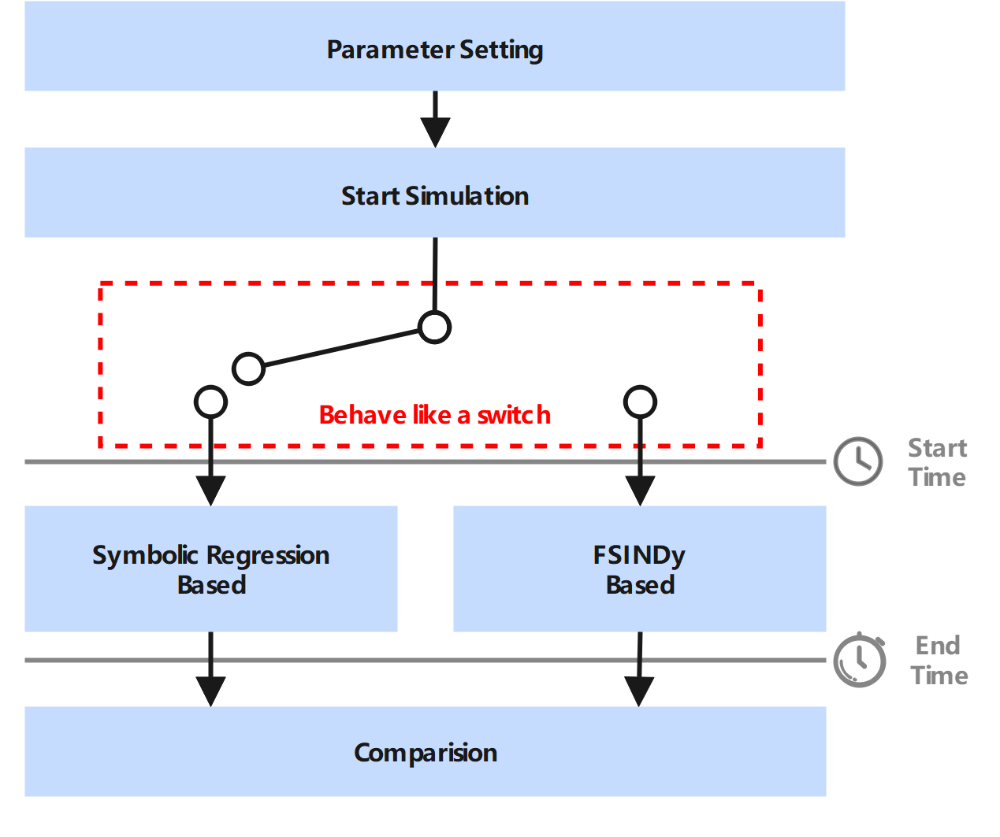
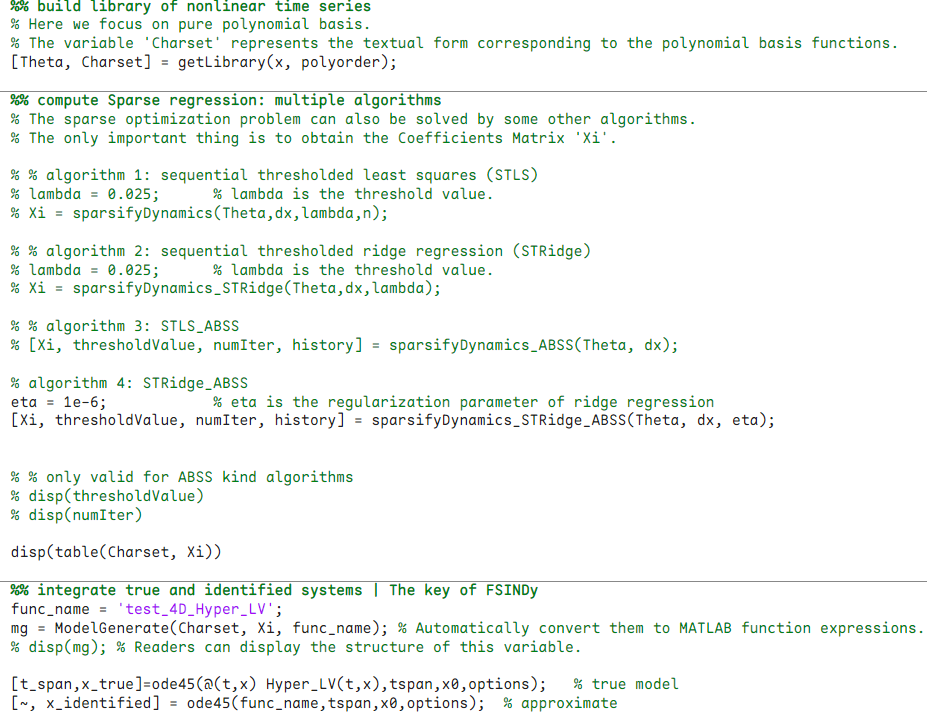

This repository contains code from our paper "Adaptive backward stepwise selection of fast sparse identification of nonlinear dynamics".

Table of contents
- [Numerical experiments](#numerical-experiments)
  - [Structure of the source code](#structure-of-the-source-code)
  - [Correspondence between the code, figures, and tables](#correspondence-between-the-code-figures-and-tables)
    - [For the manuscript](#for-the-manuscript)
    - [For the supporting information](#for-the-supporting-information)
- [Core code (FSINDy) description](#core-code-fsindy-description)
  - [The MATLAB platform](#the-matlab-platform)
  - [The Python platform](#the-python-platform)
    - [Install the original version of PySINDy (Symbolic regression-based simulation)](#install-the-original-version-of-pysindy-symbolic-regression-based-simulation)
    - [Install our developed version of PySINDy (FSINDy-based simulation)](#install-our-developed-version-of-pysindy-fsindy-based-simulation)
  - [Additional remarks](#additional-remarks)
- [The referenced code implementation](#the-referenced-code-implementation)
  - [The original SINDy](#the-original-sindy)
  - [PySINDy](#pysindy)
- [Copyright](#copyright)


## Numerical experiments
In order to present the results in a thorough and comprehensive manner, this work conducts numerical experiments verifying a series of classical benchmark dynamical system models. These include low-dimensional and high-dimensional, linear and nonlinear, and chaotic and hyperchaotic systems. They are summarized in the table below. Limited by the manuscript page, we present some examples in the manuscript, place other examples in the supporting information file, and also provide necessary illustrations within the supporting information file.
<table>
    <tr>
        <th>Type</th><th>System and Dimension</th><th>Content Position</th>
    </tr>
    <tr>
        <td rowspan="7">Low-dimensional</td><td>Linear (2D)</td><td>Supporting information</td>
    </tr>
    <tr>
        <td>Cubic (3D)</td><td>Supporting information</td>
    </tr>
    <tr>
        <td>van der Pol (2D)</td><td>Supporting information</td>
    </tr>
    <tr>
        <td>Linear (3D)</td><td>Manuscript & Supporting information</td>
    </tr>
    <tr>
        <td>Rössler (3D)</td><td>Supporting information</td>
    </tr>
    <tr>
        <td>Rigid body dynamics (3D)</td><td>Manuscript</td>
    </tr>
    <tr>
        <td>Lorenz (3D)</td><td>Supporting information</td>
    </tr>
    <tr>
        <td rowspan="4">High-dimensional</td><td>Lotka-Volterra (4D)</td><td>Supporting information</td>
    </tr>
    <tr>
        <td>Rössler Hyperchaotic (4D)</td><td>Supporting information</td>
    </tr>
    <tr>
        <td>Coupled Lorenz system (6D)</td><td>Supporting information</td>
    </tr>
    <tr>
        <td>Lorenz 96 (4D to 23D)</td><td>Manuscript & Supporting information</td>
    </tr>
</table>

### Structure of the source code
```
├─Figures
├─MATLAB
│  ├─figures
│  └─utils
└─Python
    └─Modified_pysindy
        ├─pysindy
        │  ├─deeptime
        │  │  └─__pycache__
        │  ├─differentiation
        │  │  └─__pycache__
        │  ├─feature_library
        │  │  └─__pycache__
        │  ├─optimizers
        │  │  └─__pycache__
        │  ├─utils
        │  │  └─__pycache__
        │  └─__pycache__
        ├─pysindy.egg-info
        └─__pycache__
```
where the folder `Figures` contains the figures used in the README, the folder `MATLAB` contains the code of the MATLAB version, and the folder `Python` contains the symbolic regression-based PySINDy and our modified pysindy.

### Correspondence between the code, figures, and tables
In this section, we list all the codes, figures, and tables for easy reference by readers for their evaluation and review of the relevant content.

#### For the manuscript
All figures and tables appear in the manuscript (except for the schematic diagram or flow chart).
`EX_3D_Linear.m`: Figures 3-5, Table 2.
`EX_HD_Lorenz_96.m`: Produce the results of Figure 6 by changing the dimension variable $n$ within the code.
`EX_HD_Lorenz_96_ErrorAnalysis_and_SingularValueAnalysis.m`: Figures 7 and 8.
`CEX_3D_Linear.m`: Figures 9-11, Table 3.
`CEX_3D_Linear_Noisy_Observations.fig`: Modification of Figure 9.
`EX_3D_EulerRigidBodyDynamics.m`: Figures 12-14.
`EX_TimeConsumptionAnalysis_Summary.m`: Figures 16-19. This script summarizes all relevent results in Section 3.5. The specific calculation procedure is as follows:
- `EX_TimeConsumptionAnalysis_SRBased_Low.m`: Symbolic regression based simulation for low-dimensional systems. This file generates the data for Figure Figures 16(a) and 16(b).
- `EX_TimeConsumptionAnalysis_FSINDyBased_Low.m`: FSINDy based simulation for low-dimensional systems. This file generates the data for Figures 16(c) and 16(d).
- `EX_TimeConsumptionAnalysis_SRBased_High.m`: FSINDy based simulation for some high-dimensional systems. This file generates the data for Figures 17(a) and 17(b).
- `EX_TimeConsumptionAnalysis_FSINDyBased_High.m`: Symbolic regression based simulation for some high-dimensional systems. This file generates the data for Figure Figures 17(c) and 17(d).
- `EX_TimeConsumptionAnalysis_SRBased_High_Lorenz96.m`: Symbolic regression based simulation for the Lorenz 96 system (dimension from 4 to 20). This file generates the data for Figures 18(a) and 18(b).
- `EX_TimeConsumptionAnalysis_FSINDyBased_High_Lorenz96.m`: FSINDy based simulation for the Lorenz 96 system (dimension from 4 to 20). This file generates the data for Figure Figures 18(c) and 18(d).

**Notes:** For the purpose of fair comparison, the simulations based on symbolic regression and those based on FSINDy follow the same logic. This comparison ensures that no parameters are modified, and only the reconstruction program is replaced.



#### For the supporting information
All figures and tables appear in the supporting information file.
`EX_2D_Linear.m`: Figures 3-5, Table 2.
`EX_2D_Cubic.m`: Figures 6-8, Table 3.
`EX_2D_vanDerPol.m`: Figures 9-11, Table 4.
`EX_3D_Rossler.m`: Figures 12-14, Table 5.
`EX_3D_Lorenz.m`: Figures 15-17, Table 6.
`CEX_3D_Linear.m`: Figures 18 and 19, Table 7.
`EX_4D_Lotka_Volterra.m`: Figures 20-22. The identified coefficients can be found by running this program.
`EX_4D_Hyper_Rossler.m`: Figures 23-25. The identified coefficients can be found by running this program.
`EX_6D_Hyper_Coupled_Lorenz.m`: Figures 26-28. The identified coefficients can be found by running this program.
`EX_HD_Lorenz_96_ErrorAnalysis_and_SingularValueAnalysis_For_SI.m`: This file generates the results for Figure 29 by changing variables.

## Core code (FSINDy) description
We mainly developed programs for the pure polynomial basis library. Our program is module-independent and can be extracted separately for other purposes. As long as it meets the input requirements of our program, it can be used.

### The MATLAB platform
`ModelGenerate.m`: The MATLAB class for converting Charset and Coefficients into a MATLAB function.
- `FileWriter.m`: The subclass that provide support for `ModelGenerate.m`
- `WriteFunctionFile.m`: The subclass that provide support for `ModelGenerate.m`

We provide a demonstration on how to use our program with the 4-dimensional Lotka-Volterra model, as follows:
- `Demo_4D_Lotka_Volterra.m`: A simple example demonstrates how to use our program. Run this file to see more details and results.
- The core code snippet.
    

The basic logic is as follows,
1. Build the basis library according to the data.
2. Solve the sparse optimization problem to obtain the Coefficients Matrix.
3. Automatically decode the Coefficients Matrix and corresponding Charset into MATLAB function. Then compare the reconstruction performance.

**Notes:** Any sparse optimization algorithm can be applied in Step 2. For demonstration, we present four representative algorithms. The key requirement is to obtain the correct coefficient matrix, which highlights that our FSINDy program is modular and independent of the specific algorithm used. This makes it readily adaptable for use in other researchers’ work.


### The Python platform
#### Install the original version of PySINDy (Symbolic regression-based simulation)
First, use command line to enter the folder as follows,
> cd Python

Then, use Anaconda to create a virtual environment and install as follows:
> conda create -n ps-demo python=3.10.14
> conda activate ps-demo
> pip install -r .\requirements.txt

where the `ps-demo` is the name of the virtual environment.

Here are some Jupyter interactive files used to present our results.
`Symbolic_Regression_based_EX_Lorenz96_HD.ipynb`: This program can be used to present the results (Lorenz 96 model) in the introduction section.
`Symbolic_Regression_based_EX_Lorenz63_3D.ipynb`: This program presents the classical Lorenz 96 model for demonstration.

#### Install our developed version of PySINDy (FSINDy-based simulation)
First, use command line to enter the folder as follows,
> cd Python\Modified_pysindy

Then, use Anaconda to create a virtual environment and install as follows:
> conda create -n ps-dev python=3.10.14
> conda activate ps-dev
> pip install -e .
> pip install -r .\requirements.txt

where the `ps-dev` is the name of the virtual environment. 

We provide four Jupyter interactive files to present our results and also show how to use our program.
`FSINDy_based_EX_Hyper_Rossler_4D.ipynb`: A demonstration of the 4-dimensional Hyperchaotic Rössler model.
`FSINDy_based_EX_Lorenz63_3D.ipynb`: A demonstration of the 3-dimensional Lorenz 63 model.
`FSINDy_based_EX_Lorenz96_HD.ipynb`: A demonstration of the high-dimensional Lorenz 96 model. Readers can run this program and compare its time consumption with that of `Symbolic_Regression_based_EX_Lorenz96_HD.ipynb`. 
`FSINDy_based_EX_Lotka_Volterra_4D.ipynb`: A demonstration of the 4-dimensional Lotka_Volterra model. 

By running our program, readers will know how to use it. We also believe that they will be surprised that our developed method has achieved an astonishing improvement in terms of time efficiency.

### Additional remarks
Since our MATLAB code is mainly based on the original SINDy method, the related code structure is more concise and clear. We have developed a large number of code modules and independent modules to ensure that they can run on any computer.

The Python version of the code is based on the mature PySINDy framework, which is maintained by researchers from the community. Currently, it is still under rapid development. Therefore, I can only make limited modifications. The example program I provided above is mainly used to demonstrate the effectiveness of our method and how to directly use the code.

If there are any issues when using the relevant code, please feel free to contact the corresponding author by email. We will do our best to continuously maintain this code, in order to facilitate our research in making contributions to the relevant community.

## The referenced code implementation
Since our algorithm is a direct extension of SINDy, and also in order to conduct a more comprehensive and fair comparison, we referenced previous works when conducting numerical experiments. Some code implementations directly or indirectly referred to the following related works. Those interested in the original method can refer to the following articles and codes.
### The original SINDy
- **Paper:** Brunton, Steven L., Joshua L. Proctor, and J. Nathan Kutz. “Discovering Governing Equations from Data by Sparse Identification of Nonlinear Dynamical Systems.” Proceedings of the National Academy of Sciences 113, no. 15 (2016): 3932–37. https://doi.org/10.1073/pnas.1517384113.
- **Official open source code:** http://faculty.washington.edu/sbrunton/sparsedynamics.zip

### PySINDy
- **Paper 1:** De Silva, Brian, Kathleen Champion, Markus Quade, Jean-Christophe Loiseau, J. Kutz, and Steven Brunton. “PySINDy: A Python Package for the Sparse Identification of Nonlinear Dynamical Systems from Data.” Journal of Open Source Software 5, no. 49 (2020): 2104. https://doi.org/10.21105/joss.02104.
- **Paper 2:** Kaptanoglu, Alan A., Brian M. de Silva, Urban Fasel, et al. “PySINDy: A Comprehensive Python Package for Robust Sparse System Identification.” Journal of Open Source Software 7, no. 69 (2022): 3994. https://doi.org/10.21105/joss.03994.
- **Official open source code:** https://github.com/dynamicslab/pysindy

## Copyright
Copyright 2025, All Rights Reserved

For Paper, 
- "Adaptive backward stepwise selection of fast sparse identification of nonlinear dynamics" ,

by Feng JIANG, Lin DU, Qing XUE, Zichen DENG, and Celso GREBOGI